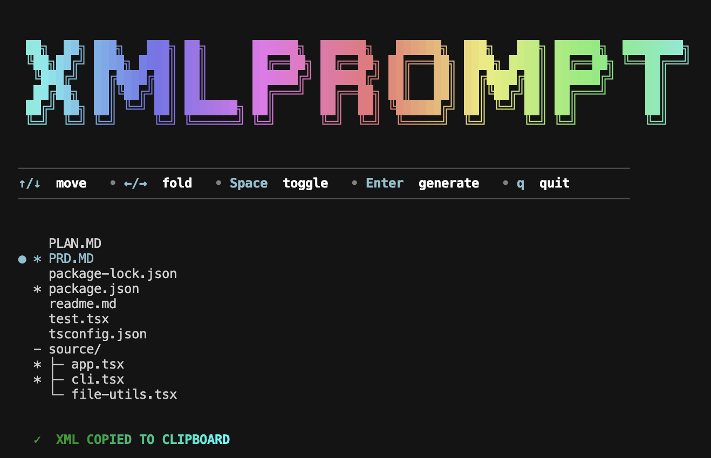

# XMLPrompt CLI

> *Zero‑mouse, zero‑boilerplate way to wrap any slice of your codebase in well‑formed XML and shoot it straight into your favourite LLM.*

<div align="center">


</div>



---

## What is XMLPrompt CLI?

`xmlprompt` is a tiny interactive CLI that:

1. **scans your repo**, obeying `.gitignore` & `.xmlpromptignore`;
2. lets you **star files/folders** via an Ink‑powered tree view;
3. **streams the selection as pretty‑printed XML** → clipboard / stdout / file.

It’s the missing capture tool for [**XML Prompt Builder**](https://xmlprompt.dev) — the visual prompt editor that turns those XML trees into production‑ready prompts.

<details>
<summary>Why XML style prompting?</summary>
<br>

* Hierarchy beats tokens. Wrapping each file in `<file name="…">…</file>` gives the llm clear boundaries for scope, folders, and filenames—this is what antwerp’s “de-chunking with xml” article recommends.
* Clarity and accuracy. xml tags make it easy for the model to separate context, instructions, and examples, reducing confusion and improving output quality.
* Streaming-friendly. xml is simple to append or concatenate while preserving structure.
* Decoder-friendly. many agents (chatgpt, claude, gemini) have dedicated xml tag parsers, which helps reduce hallucinations compared to markdown code fences.
* Flexibility. you can easily add, remove, or modify parts of your prompt by updating specific tags, without rewriting the whole thing.

</details>

---

## Features

| Feature              | Details                                                                    |
| -------------------- | -------------------------------------------------------------------------- |
| **Interactive TUI**  | Smooth scrolling tree, arrow‑key folding, tri‑state folder marks ✔ ／ － ／ ○ |
| **One‑touch export** | Clipboard *(TTY)*, stdout *(when piped)* or `-o` to a file                 |
| **Config‑aware**     | Reads `.gitignore`                     |
| **Single‑binary**    | Install once or just run `npx xmlprompt`                                   |
| **Cross‑platform**   | macOS (arm + x64), Linux, Windows/WSL                                      |

---

## Quick Start

```bash
npx xmlprompt             # launch inside any git repo
```

<table>
<tr><th align="left">Key</th><th align="left">Action</th></tr>
<tr><td>↑ / ↓</td><td>move cursor</td></tr>
<tr><td>← / →</td><td>fold / unfold directory</td></tr>
<tr><td>Space</td><td>toggle select</td></tr>
<tr><td>Enter</td><td>generate XML</td></tr>
<tr><td>q / Esc</td><td>quit</td></tr>
</table>

> **Workflow tip:** open ChatGPT or Gemini in one pane, your editor in another, and keep a terminal floating. `xmlprompt > ⌘V > ask your question`.

---

## 🛠️ Installation

```bash
npm  i -g xmlprompt     # global
pnpm add -g xmlprompt
bun xmlprompt          # zero‑install single run
```

---

## Output schema

```xml
<root>
  <folder>
    <file>
      // code here…
    </file>
  </folder>
</root>
```

Binary files are skipped; line endings preserved.

---

## Configuration

Same syntax as `.gitignore`; merged automatically.

---

## Roadmap

* [ ] `--watch` mode → auto‑copy on save
* [ ] VS Code “Copy as XML” command
* [ ] Tauri drag‑and‑drop desktop wrapper

Vote or propose features in [issues](https://github.com/lolrazh/xmlprompt/issues).

---

## 🪪 License

MIT © 2025 Sandheep & contributors
